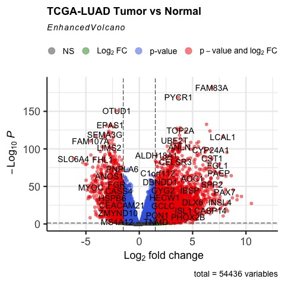

# Analysis of TCGA Lung Adenocarcinoma Transcriptomics Data

This repository presents and exploratory and differential gene expression analysis of TCGA-LUAD (Lung Adenocarcinoma) RNA-Seq data, comparing **Tumour** and **Normal** tissue samples. The analysis aims to identify key differentially expressed genes (DEGs) that may play a significant role in tumor development and progression.

**Total samples analysed:**

- Tumour samples: 541
- Normal samples: 59

**Total Genes analysed**

- 60,659 genes

## Selection of Data

Data was selected from the TCGA atlas/Genomic Commons Database using these filters:

- **Project Name:** TCGA-LUAD
- **Data Type:** Gene Expression
- **Access:** Open
- **Tissue Type:** Tumour/Normal

## Analysis Workflow

1. **Data Extraction** - gene count files were downloaded from the TCGA atlas/Genomic Commons Databased using the GenomicDataCommons package
2. **Data Processing** - raw counts extracted, merged and filtered to remove low-expression genes
3. **Differential Expression Analysis** - using DESeq2
4. **Visualisation** - using volcano plots and heatmap

## Results

### Volcano plot

A large number of genes were found to be significantly differentially expressed between Tumor and Normal tissues.

- Significance was determined based on:
  - Adjusted p-value < 0.05
  - |log2 Fold Change| > 1.5
- Upregulated Genes in Tumor (examples):
  - FAM83A (log2FC ≈ 6.79)
  - AFAP1-AS1 (log2FC ≈ 6.31)
  - PYCR1 (log2FC ≈ 3.68)
- Downregulated Genes in Tumor (examples):
  - EPAS1 (log2FC ≈ -2.72)
  - OTUD1 (log2FC ≈ -2.11)
  - STX11 (log2FC ≈ -3.06)

### DESeq2 Results Table

| Gene       | log2 Fold Change | Adjusted p-value       | Interpretation                               |
|:----------:|:---------------:|:---------------------:|:--------------------------------------------:|
| **FAM83A** | +6.79          | 1.51 × 10⁻¹⁷⁷        | Strongly upregulated in Tumor samples        |
| **AFAP1-AS1** | +6.31      | 2.45 × 10⁻¹²⁹        | Highly expressed in Tumor, known oncogene    |
| **PYCR1** | +3.68          | 4.49 × 10⁻¹⁶⁵        | Involved in proline biosynthesis, tumor growth |
| **EPAS1** | -2.72          | 1.17 × 10⁻¹²⁸        | Downregulated; related to hypoxia signaling  |
| **OTUD1** | -2.11          | 2.14 × 10⁻¹⁴⁷        | Potential tumor suppressor                   |

## Conclusion

The analysis shows key genes that are significantly dysregulated in TCGA-LUAD Tumour samples compared to normal tissues.